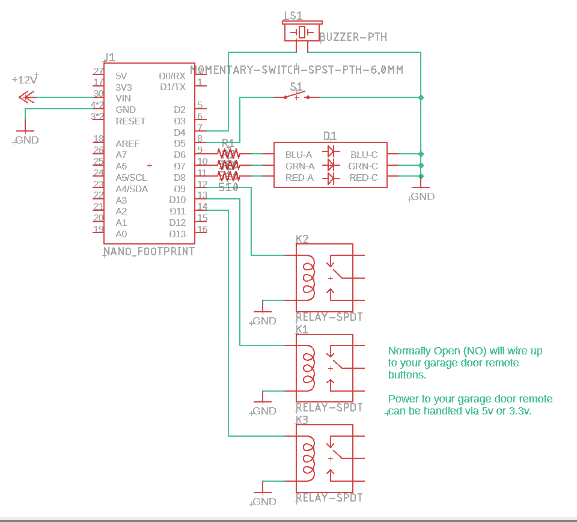
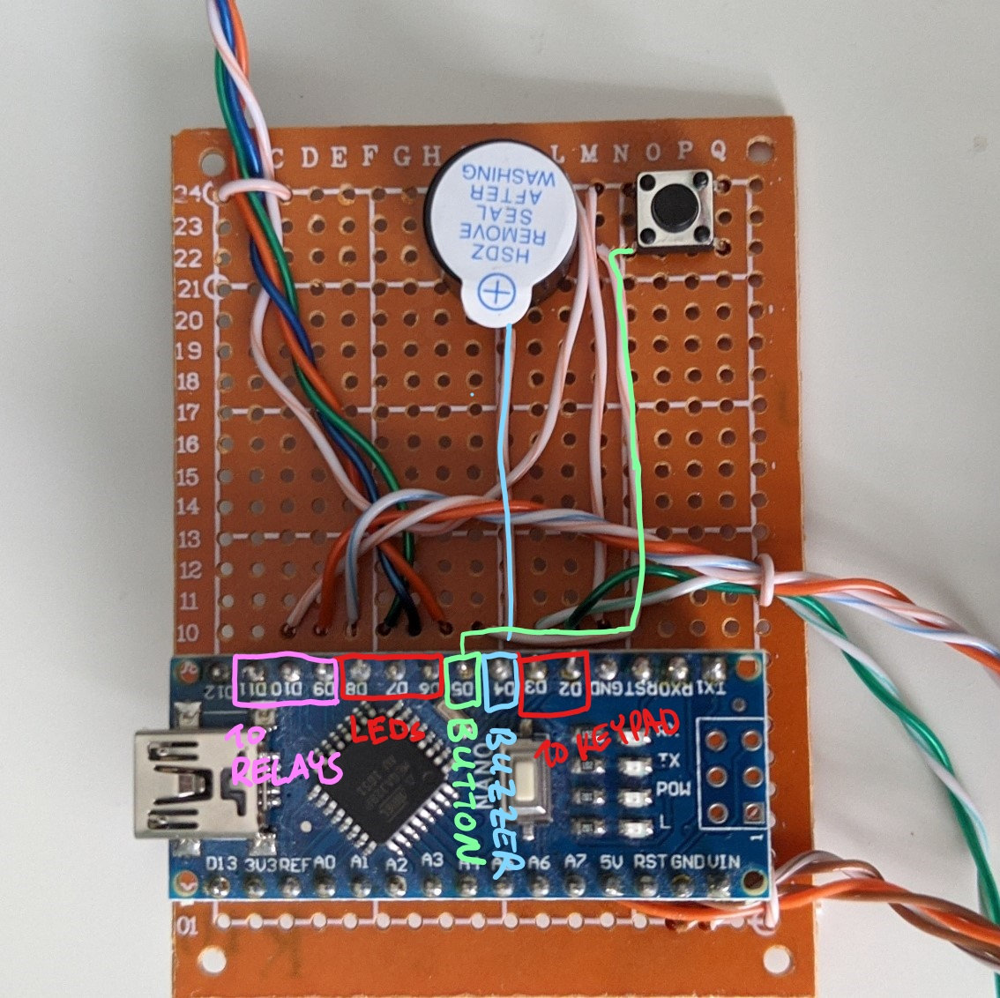
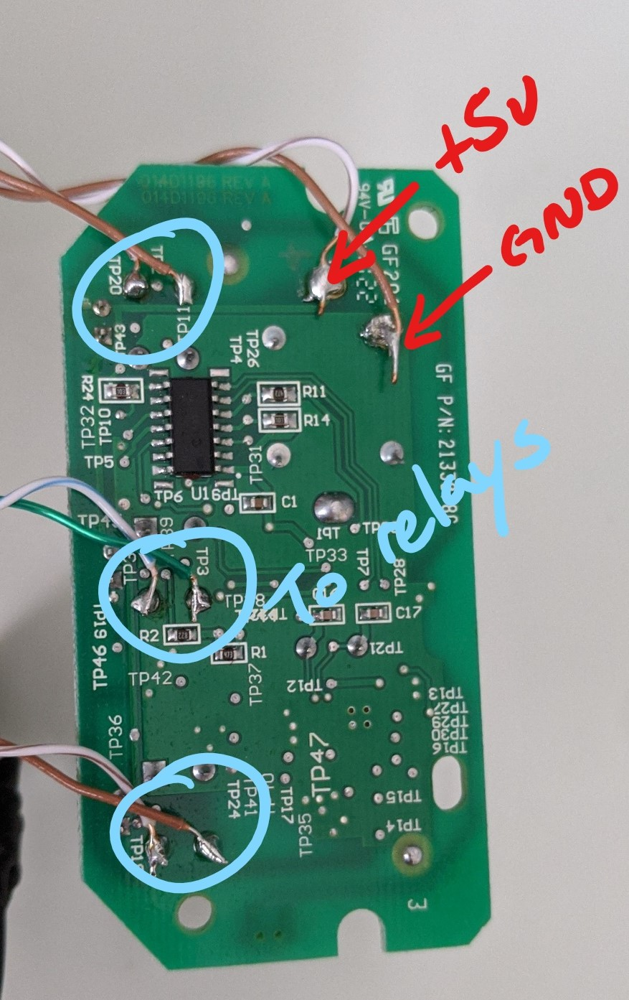

# Arduino-GarageDoorOpener
Arduino project that uses a Wiegand keypad to work as a garage door opener. 

# Instructions

## Add Passcode
Short pressing the input button will enter passcode entry.  The LED will flash green - you'll have 15 seconds to input a passcode of up to 8 digits.  Then press the "#" to confirm.

## Erase All Passcodes
Long pressing the input button (5 seconds) will trigger a memory wipe and erase all stored passcodes.

## Opening The Door
1) Enter the passcode
2) Press the "#" key

It the passcode is valid, the LED will flash indicating you're in door selection mode

3) Press either 1, 2, or 3 button 
4) Press the "#" key

# Schematic
The schematic below shows the main circuitry.  The Arduino Nano accepts 12v in Vin, and the 5v output is used to power the relays and the garage door remote.

Note: 
Not shown on the schematic is that you need power to the relays.  I purchased 5v relays, so the +5v was drawn from the Arduino +5v.  There are 12v relays available too, in which case you'll draw power from the 12v power supply.

# Parts
All these parts can be found easily on Amazon or Aliexpress
Part|Count|Notes
-|-|-
Arduino Nano| x1 | 
510 Ohm Resistor|x3| load resistors for LEDs
Tricolour LED | x1 | 
Buzzer | x1 | 
High Trigger Relay | x3 | used to interface to the garage door opener remote
Moment Switch | x1 | used to add or clear codes
12v power supply | x1 | main power source for Wiegand keypad and arduino.  A cheap $10-15 ac adapter with 12v @ 2A should be more than enough. 
Wiegand keypad | x1 | I used the Retekess H1EM-W 
Garage door remote | x1 | if your garage door opener is a newer one, you can't directly trigger the garage door open/close on the main unit.  I've tied it into the garage door remote instead.

# Code Notes
## Max Passcode Length
The max passcode length is 8. So all passcodes are stored will take up 8 bytes.  You can change by altering the MAXCODESIZE definition.  Make sure you also change the keyMemory KEYSIZE definition to the same length.

## RFID 
This code has not been tested with RFID tags. The wiegand device I used supports it, but I never had any to test or code with.  So, if you do use this code, you may need to make minor modifications. 

# Reference
Heavily inspired by Jason Hamilton.  I heavily modified the keyMemory.h to make it a little easiler to use.  You can find his work here: https://bitbucket.org/jason955/arduino-access-control/src/master/

# Assembly
Basic assembly is basically a few main parts:
1) Through hole board with Arduino, LEDs, button, and buzzer
2) Garage door remote wireup
3) Connecting everything together

## Through-hold Board with Arduino
Basically you're looking to get your Arduino board soldered to the through-hole board (with sockets - not directly) along with some wires so you can hook into the relays and keypad.  See images below.

## Garage Door Wireup
As stated earlier, newer garage door openers don't have two pins on the main unit to short to trigger the garage door to open.  With no easy access, you'll have to sacrifice a garage door remote to make it work.  The unit i used was from LiftMaster and is designed to be used in your car.  Opening up the casing and you'll see a very simple mainboard - we'll use relays to act as button presses.  

1) Add wire to the buttons so we can hook it up to the relays
2) Add wire to the solder points where the battery normally goes.  We'll use the +5v from the arduino to power it rather use batteries

