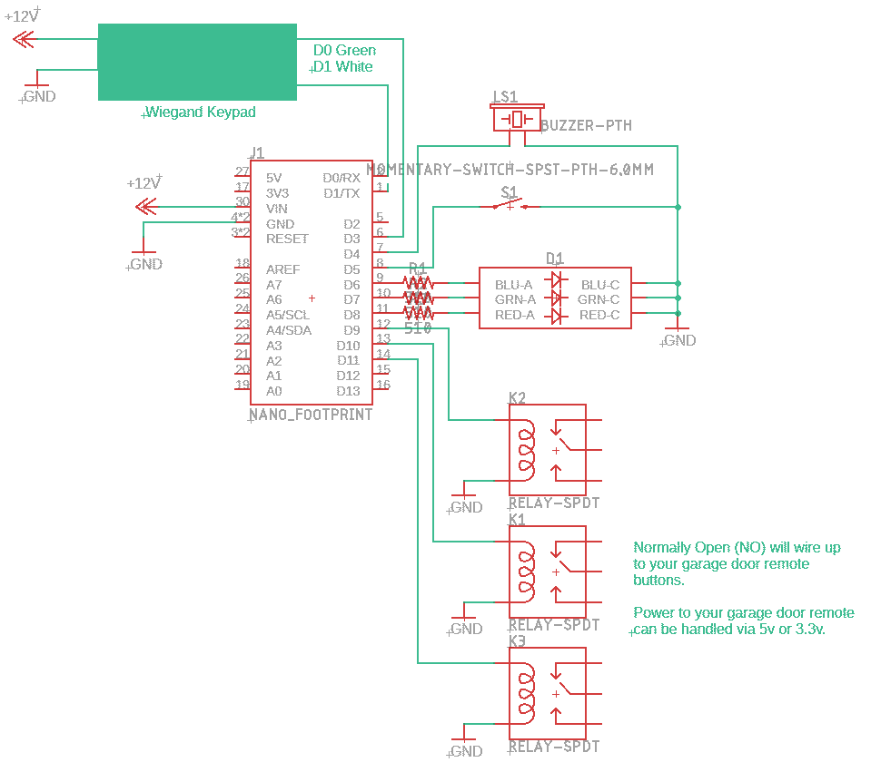

# Arduino-GarageDoorOpener
Arduino project that uses a Wiegand keypad to work as a garage door opener.  

# Schematic
The schematic below shows the main circuitry.  The Arduino Nano accepts 12v in Vin, and the 5v output is used to power the relays and the garage door remote.

Note: 
Not shown on the schematic is the Wiegand keypad wireup:
- Wiegand D0 (usually green) => Arduino D2
- Wiegand D1 (usually white) => Arduino D3

# Parts:
Part|Count|Notes
-|-|-
Arduino Nano| x1 | 
510 Ohm Resistor|x3| load resistors for LEDs
Tricolour LED | x1 | 
Buzzer | x1 | 
High Trigger Relay | x3 | used to interface to the garage door opener remote
Moment Switch | x1 | used to add or clear codes
12v power supply | x1 | main power source for Wiegand keypad and arduino
Weigand keypad | x1 | I used the Retekess H1EM-W 
Garage door remote | x1 | if your garage door opener is a newer one, you can't directly trigger the garage door open/close on the main unit.  I've tied it into the garage door remote instead.
